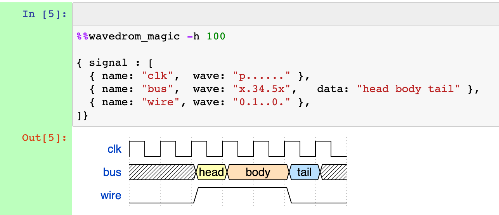
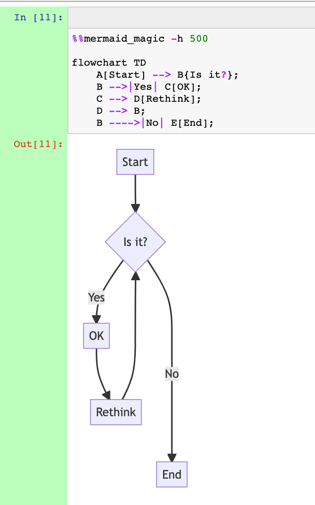
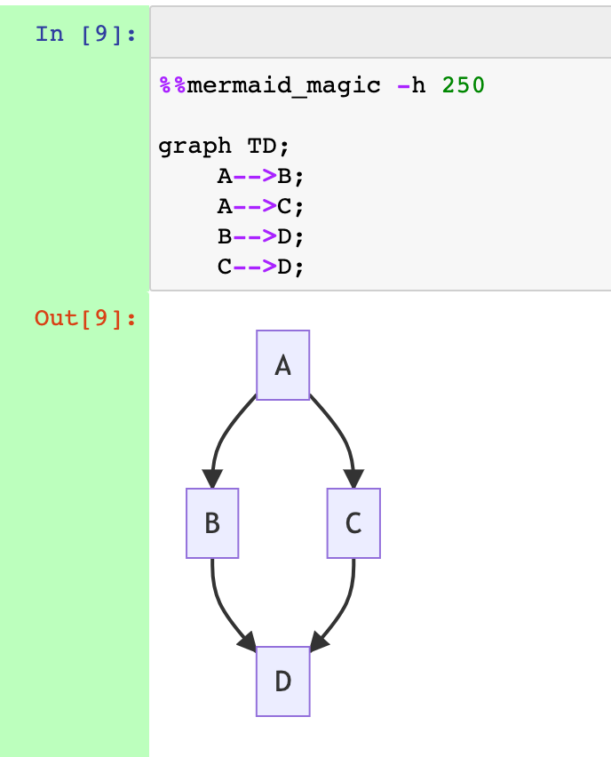
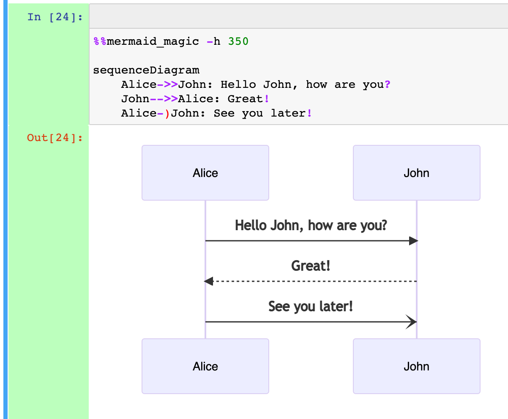
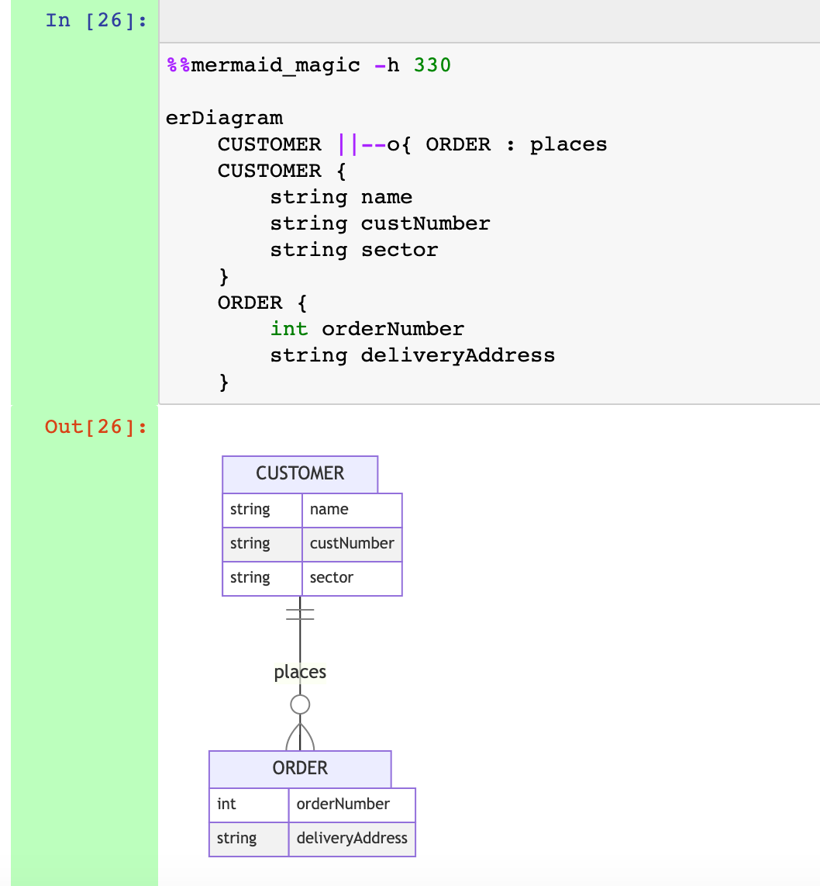
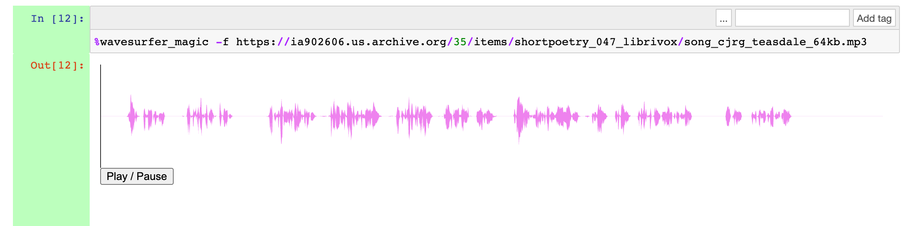

# nb_js_diagrammers

IPython magics for rendering diagrams from simple scripts in Jupyter notebooks using various JavaScript diagram generators.

Simple magics for rendering diagrams from line and cell magics using the following JavaScript diagram generators:

- [Mermaid.js](https://mermaid-js.github.io/mermaid/#/): a wide variety of diagram types, including flowcharts, sequence diagrams, entity relationship diagrams
- [flowchart.js](http://flowchart.js.org/): flowchart generator
- [wavedrom](https://github.com/wavedrom/wavedrom): timing diagram generator
- [waversurfer.js](https://wavesurfer-js.org/): audio waveform visualisation

## Installation

Install from PyPi as: `pip install --upgrade nb-js-diagrammers`

Install direct from this repository as:

`pip install --upgrade git+https://github.com/innovationOUtside/nb_js_diagrammers.git`

or:

`pip install --upgrade https://github.com/innovationOUtside/nb_js_diagrammers/archive/main.zip`

## Usage

Install the magics in a notebook as:

`%load_ext nb_js_diagrammers`


All magics support a `-o / --outfile` that can be used to specify the name of a generated html file that is then embedded in the notebook via an iframe. If no filename is specified, a filename with a randomly generated UID based will be created.
 
You can then generate diagrams using the appropriate diagram syntax and magic:

```text
%%flowchart_magic -h 100 -o flowchart.html

st=>start: Start
e=>end: End
op1=>operation: Generate
op2=>parallel: Evaluate
st(right)->op1(right)->op2
op2(path1, top)->op1
op2(path2, right)->e
```


```text
%%wavedrom_magic -h 100

{ signal : [
  { name: "clk",  wave: "p......" },
  { name: "bus",  wave: "x.34.5x",   data: "head body tail" },
  { name: "wire", wave: "0.1..0." },
]}
```



```text
%%mermaid_magic -h 500

flowchart TD
    A[Start] --> B{Is it?};
    B -->|Yes| C[OK];
    C --> D[Rethink];
    D --> B;
    B ---->|No| E[End];
```



```text
%%mermaid_magic -h 250

graph TD;
    A-->B;
    A-->C;
    B-->D;
    C-->D;
```



```text
%%mermaid_magic -h 350

sequenceDiagram
    Alice->>John: Hello John, how are you?
    John-->>Alice: Great!
    Alice-)John: See you later!
```



```text
%%mermaid_magic -h 330

erDiagram
    CUSTOMER ||--o{ ORDER : places
    CUSTOMER {
        string name
        string custNumber
        string sector
    }
    ORDER {
        int orderNumber
        string deliveryAddress
    }
```



```text
%wavesurfer_magic -fhttps://ia802606.us.archive.org/35/items/shortpoetry_047_librivox/abou_ben_adhem_hunt_mlb.mp3
```



## Generating Flowcharts from Python Code

An additional magic is provided that uses the [`pyflowchart`](https://github.com/cdfmlr/pyflowchart/) package to generate a flowchart describing Python code cell in an appropriately magicked code cell:

```text
%%pyflowchart_magic -h 800
import time

def demo(msg='demo'):
    for i in range(10):
        print(f'{msg} loopcount is {i}')
        time.sleep(i)
```

The `-x / --execute` flag will execute the code in the current notebook scope. *Without the flag, the code is not executed.*

More clunkily, we can also grab and chart code from an executed code cell using the following recipe (this captures cell content from the previously executed cell):

```python
%%capture code
# This gets the content of the previous cell
# and stores it in the variable: code
%history -l 1
```

We can then render a flowchart from the captured code cell content:

```python
from pyflowchart import Flowchart

from nb_js_diagrammers.flowchartjs import TEMPLATE_FLOWCHARTJS
from nb_js_diagrammers.magics import js_ui

# Generate a flowchart from the grabbed code
fc = Flowchart.from_code(code.stdout)

# Render the flowchart via an external, IFrame embedded HTML page - DEPRECATED
# (Code in package but commented out)
#js_ui({"src":fc.flowchart()}, TEMPLATE_FLOWCHARTJS, height=800)

# Render flowchart via repr_html IFrame with html in srcdoc
diagram = JSDiagram(fc.flowchart()}, TEMPLATE_FLOWCHARTJS, height=200)
diagram
```

We can also save the HTML to a file:

```python
diagram.save_html("myfile.html")
```

## Generating Static Image Files

To generate static image files using `mermaid.js`, see: https://github.com/mermaid-js/mermaid-cli

The `wavedrom` images have a save as png or SVG option (right click over diagram)

## Further reading

[*A Simple Pattern for Embedding Third Party Javascript Generated Graphics in Jupyter Notebooks*](https://blog.ouseful.info/2021/09/30/a-simple-pattern-for-embedding-third-party-javascript-generated-graphics-in-jupyter-notebools/)

## See also

[*Previewing Sphinx and Jupyter Book Rendered Mermaid and Wavedrom Diagrams in VS Code*](https://blog.ouseful.info/2021/11/02/previewing-sphinx-and-jupyter-book-rendered-mermaid-and-wavedrom-diagrams-in-vs-code/)