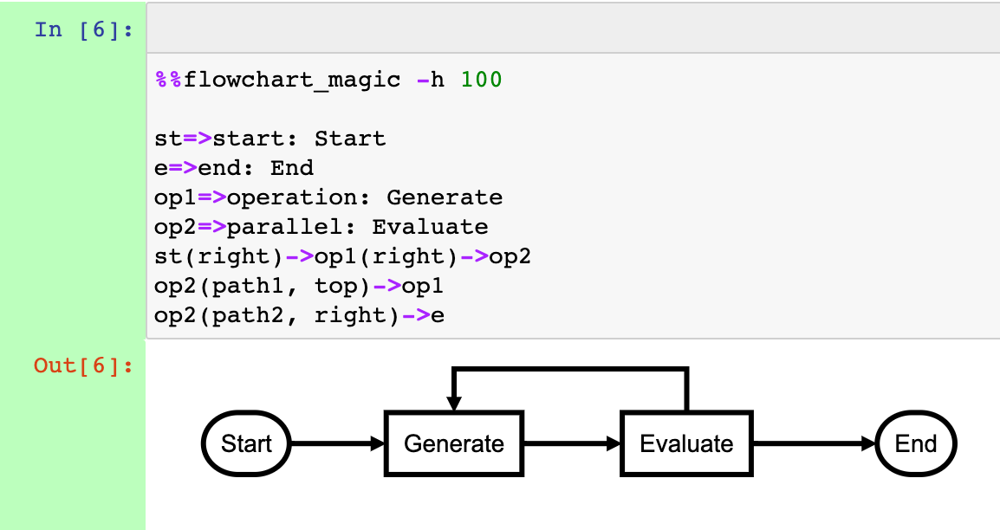

# nb_js_diagrammers

IPython magics for rendering diagrams from simple scripts in Jupyter notebooks using various JavaScript diagram generators.

Simple magics for rendering diagrams from line and cell magics using the following JavaScript diagram generators:

- [Mermaid.js](https://mermaid-js.github.io/mermaid/#/): a wide variety of diagram types, including flowcharts, sequence diagrams, entity relationship diagrams
- [flowchart.js](http://flowchart.js.org/): flowchart generator
- [wavedrom](https://github.com/wavedrom/wavedrom): timing diagram generator
- [waversurfer.js](https://wavesurfer-js.org/): audio waveform visualisation

## Installation

Install from PyPi as: `pip install --upgrade nb-js-diagrammers`

Install direct from this repository as:

`pip install --upgrade git+https://github.com/innovationOUtside/nb_js_diagrammers.git`

or:

`pip install --upgrade https://github.com/innovationOUtside/nb_js_diagrammers/archive/main.zip`

## Usage

Install the magics in a notebook as:

`%load_ext nb_js_diagrammers`

You can then generate diagrams using the approriate diagram syntax and magic:

```text
%%flowchart_magic -h 100

st=>start: Start
e=>end: End
op1=>operation: Generate
op2=>parallel: Evaluate
st(right)->op1(right)->op2
op2(path1, top)->op1
op2(path2, right)->e
```



```text
%%wavedrom_magic -h 100

{ signal : [
  { name: "clk",  wave: "p......" },
  { name: "bus",  wave: "x.34.5x",   data: "head body tail" },
  { name: "wire", wave: "0.1..0." },
]}
```


```text
%%mermaid_magic -h 250

graph TD;
    A-->B;
    A-->C;
    B-->D;
    C-->D;
```


```text
%%mermaid_magic -h 350

sequenceDiagram
    Alice->>John: Hello John, how are you?
    John-->>Alice: Great!
    Alice-)John: See you later!
```


```text
%%mermaid_magic -h 330

erDiagram
    CUSTOMER ||--o{ ORDER : places
    CUSTOMER {
        string name
        string custNumber
        string sector
    }
    ORDER {
        int orderNumber
        string deliveryAddress
    }
```


```text
%wavesurfer_magic -f https://ia902606.us.archive.org/35/items/shortpoetry_047_librivox/song_cjrg_teasdale_64kb.mp3
```


## Generating Static Image Files

To generate static image files using `mermaid.js`, see: https://github.com/mermaid-js/mermaid-cli

The `wavedrom` images have a save as png or SVG option (right click over diagram)

## Further reading

[*A Simple Pattern for Embedding Third Party Javascript Generated Graphics in Jupyter Notebooks*](https://blog.ouseful.info/2021/09/30/a-simple-pattern-for-embedding-third-party-javascript-generated-graphics-in-jupyter-notebools/)

## See also

[*Previewing Sphinx and Jupyter Book Rendered Mermaid and Wavedrom Diagrams in VS Code*](https://blog.ouseful.info/2021/11/02/previewing-sphinx-and-jupyter-book-rendered-mermaid-and-wavedrom-diagrams-in-vs-code/)